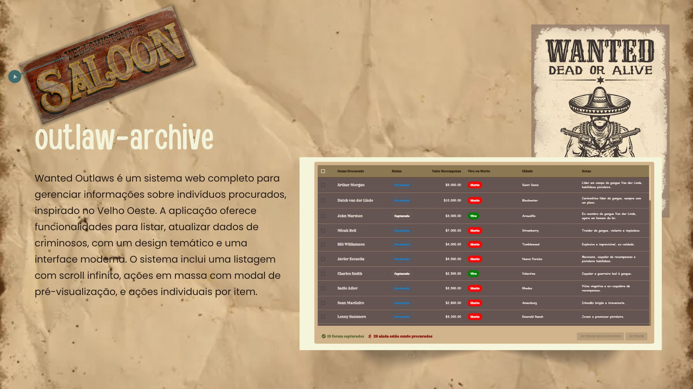

# Wanted Outlaws - Sistema de Gerenciamento de Procurados

## Sobre o Projeto

Wanted Outlaws é um sistema web completo para gerenciar informações sobre indivíduos procurados, inspirado no Velho Oeste. A aplicação oferece funcionalidades para cadastrar, listar, buscar e atualizar dados de criminosos, com um design temático e uma interface moderna. O sistema inclui uma listagem com scroll infinito, ações em massa com modal de pré-visualização, e ações individuais por item.

## ️ Visualização



## ️ Tecnologias Utilizadas

### Backend (NestJS + PostgreSQL)

- **NestJS:** Framework escalável baseado em Node.js para a construção da API.
- **TypeORM:** ORM para facilitar a interação com o banco de dados PostgreSQL.
- **PostgreSQL:** Banco de dados relacional para armazenar as informações dos procurados.
- **Docker:** Para conteinerização do backend e banco de dados, facilitando a implantação e o desenvolvimento.

### Frontend (React + Material UI)

- **React.js:** Biblioteca JavaScript para construção de interfaces de usuário dinâmicas e reativas.
- **Material UI:** Framework de componentes React para estilização e criação de uma interface de usuário consistente e responsiva.
- **React Hook Form:** Biblioteca para gerenciamento de formulários no React, simplificando a validação e o envio de dados.
- **Scroll Infinito:** Implementação de carregamento contínuo de dados na listagem de procurados, melhorando a experiência do usuário.
- **Ações em Massa:** Funcionalidade para selecionar múltiplos itens e aplicar uma ação a todos simultaneamente.
- **Modal de Pré-visualização:** Exibição dos itens selecionados em uma modal antes da aplicação da ação em massa.
- **Ações Individuais:** Capacidade de realizar ações específicas em cada item da lista, como editar o nome diretamente na listagem.

### Orquestração (Docker Compose)

- **Docker:** Para criar um ambiente de desenvolvimento isolado e consistente.
- **Docker Compose:** Para gerenciar e orquestrar os containers do backend, frontend e banco de dados.

## Como Utilizar

### Pré-requisitos

Antes de começar, certifique-se de que você tem as seguintes ferramentas instaladas na sua máquina:

- **Docker:** Para conteinerização e orquestração dos serviços.
- **Node.js:** Para executar o backend (NestJS) e o frontend (React).
- **npm ou Yarn:** Gerenciador de pacotes para instalar as dependências.
- **Docker Compose CLI:** Para orquestrar os containers Docker.

### Passos para Execução

1.  **Clone o Repositório:**

    - Clone o repositório do projeto para a sua máquina local.

2.  **Inicie o Banco de Dados (PostgreSQL):**

    - Na raiz do projeto, execute o seguinte comando para iniciar o container do PostgreSQL:

      ```bash
      docker-compose up -d postgres
      ```

    - Este comando iniciará o banco de dados em segundo plano.

3.  **Inicie o Backend (NestJS):**

    - Após o banco de dados estar em execução, inicie o container do backend:

      ```bash
      docker-compose up -d backend
      ```

    - Este comando iniciará a API do backend em segundo plano.

4.  **Inicie o Frontend (React):**

    - Com o backend em execução, inicie o container do frontend:

      ```bash
      docker-compose up -d frontend
      ```

    - Este comando iniciará a aplicação frontend em segundo plano.

5.  **Acesse a Aplicação:**
    - Após todos os containers estarem em execução, você pode acessar a aplicação no seu navegador:
      - Frontend: Acesse `http://localhost:3000`
      - Backend: Acesse `http://localhost:3333`

### Observações

- O comando `docker-compose up -d` executa os containers em modo "detached" (em segundo plano).
- Para parar os containers, execute `docker-compose down` na raiz do projeto.
- Para verificar os logs dos containers, use `docker logs <nome_do_container>`.
- Certifique-se de que as variáveis de ambiente estão configuradas corretamente nos arquivos `.env` e `docker-compose.yml`.

Com estes passos, você terá o sistema Wanted Outlaws em execução na sua máquina local.

## Funcionalidades Principais

- ✅ **Cadastro e edição de procurados:** Permite adicionar e modificar informações dos procurados.
- ✅ **Listagem paginada com scroll infinito:** Exibe os procurados em uma lista com carregamento contínuo.
- ✅ **Ações em massa com modal de pré-visualização:** Seleção de múltiplos itens e aplicação de ações em lote, com confirmação em modal.
- ✅ **Ações individuais por item:** Edição de informações específicas de cada procurado diretamente na lista.
- ✅ **Filtros de busca:** Permite filtrar a listagem por diferentes critérios (nome, status, etc.).
- ✅ **Aplicação de temas e estilização inspirada no Velho Oeste:** Design temático para uma experiência imersiva.
- ✅ **Integração com PostgreSQL via TypeORM:** Facilita a interação com o banco de dados.
- ✅ **Deployment facilitado com Docker:** Conteinerização para implantação simplificada.
